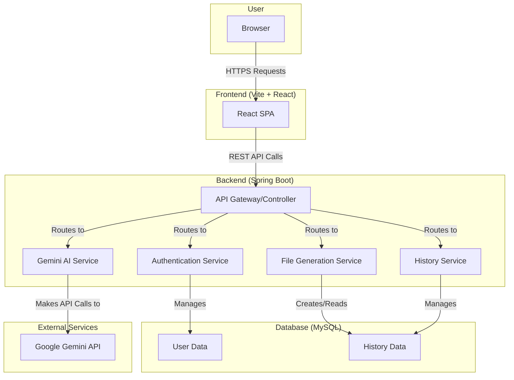
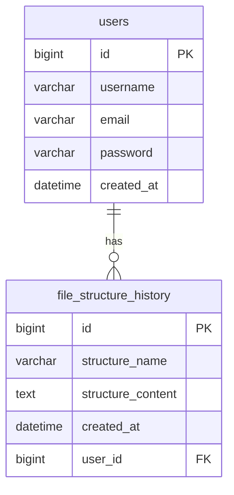
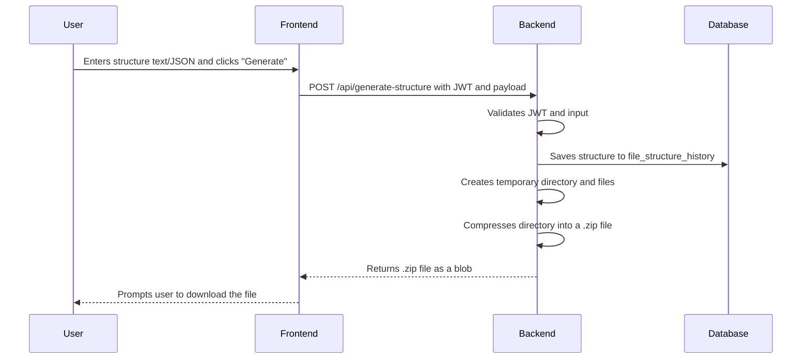

# StructZip: AI-Powered File Structure Generator

**StructZip** is a modern web application designed to streamline the project scaffolding process. It allows developers to generate, organize, and download professional file structures in seconds using an intuitive interface and AI-powered assistance.

-----

## 🚀 Project Overview

StructZip is a web-based utility that empowers developers to create complete and well-organized file and folder structures for their software projects. Users can define a structure using simple indented text or a more precise JSON format, and the application generates a downloadable `.zip` archive instantly.

This tool is designed for software developers, project managers, and students who need to quickly set up new projects without manually creating each file and folder. It saves time, reduces setup errors, and promotes best practices in project organization from the very beginning. The integrated AI assistant further helps users refine their structures, suggest improvements, and answer questions related to project architecture.

-----

## ✨ Key Features

  * **Dual Format Input**: Define structures using either simple indented text or a structured JSON format.
  * **Instant ZIP Generation**: Download the complete folder hierarchy as a `.zip` file with a single click.
  * **User Authentication**: Secure user accounts for saving and managing generated structures.
  * **AI-Powered Chat Assistant**: An integrated Gemini-powered chat widget helps users design optimal file hierarchies, suggests best practices, and debugs structure definitions.
  * **Generation History**: Authenticated users can view, manage, and reuse their previously generated structures.
  * **Smart Validation**: The backend service validates user input to ensure it follows best practices and is syntactically correct.
  * **Responsive Frontend**: A modern, responsive user interface built with React and Tailwind CSS ensures a seamless experience on any device.
  * **Secure API**: The backend is secured using JWT (JSON Web Tokens) to protect user data and endpoints.

-----

## 🏗️ Architecture Diagram

The system is composed of a React single-page application (SPA) frontend, a Spring Boot backend API, a MySQL database, and an external integration with the Google Gemini API for AI-powered features.



**Caption**: The user interacts with the React frontend, which communicates with the Spring Boot backend via a REST API. The backend handles business logic, authentication, and database interactions, and also communicates with the external Gemini API to provide AI assistance.

-----

## 🗄️ Database Schema

The database consists of two main tables: `users` to store user account information and `file_structure_history` to store records of generated structures for each user.

### ER Diagram



### Table Descriptions

  * **`users`**: Stores information about registered users.
      * `id`: Unique identifier for the user.
      * `username`: User's unique username.
      * `email`: User's unique email address.
      * `password`: Hashed password for authentication.
      * `created_at`: Timestamp of when the account was created.
  * **`file_structure_history`**: Stores a log of each file structure generated by a user.
      * `id`: Unique identifier for the history record.
      * `structure_name`: The name of the project/structure provided by the user.
      * `structure_content`: The raw text or JSON input provided by the user.
      * `created_at`: Timestamp of when the structure was generated.
      * `user_id`: A foreign key linking to the `users` table.

-----

## 🌐 API Endpoints

The backend exposes a REST API for handling authentication, file generation, and user history.

  * **Authentication**
      * `POST /api/auth/register`: Creates a new user account.
      * `POST /api/auth/login`: Authenticates a user and returns a JWT.
  * **File Generation**
      * `POST /api/generate-structure`: Accepts a structure definition (text or JSON) and returns a `.zip` file. (Requires authentication)
  * **User & History**
      * `GET /api/user/history`: Retrieves a list of all structures generated by the authenticated user.
      * `DELETE /api/history/{id}`: Deletes a specific history item for the authenticated user.
      * `GET /api/user/profile`: Retrieves the profile information of the authenticated user.
  * **AI Chat**
      * `POST /api/gemini-chat`: Proxies a user's message to the Gemini API and returns the AI's response. (Requires authentication)

### User Flow for File Generation



-----

## 📦 Data Models

  * **User**: Represents a registered user with properties like `id`, `username`, `email`, and `password`. This model directly maps to the `users` table.
  * **FileStructureHistory**: Represents a single entry in a user's generation history, containing the `structureName`, `structureContent`, `createdAt`, and a reference to the `User`. This maps to the `file_structure_history` table.
  * **AuthRequest**: A Data Transfer Object (DTO) used for login and registration, carrying `username`, `email`, and `password`.
  * **StructureRequest**: A DTO used for the file generation endpoint, carrying the `structureContent` and `structureName`.

-----

## 💻 Tech Stack

  * **Frontend**:
      * **Framework**: React 18
      * **Routing**: React Router
      * **Styling**: Tailwind CSS
      * **Animations**: Framer Motion
      * **Build Tool**: Vite
  * **Backend**:
      * **Framework**: Spring Boot 3
      * **Language**: Java 17
      * **Security**: Spring Security (JWT)
      * **Data Access**: Spring Data JPA (Hibernate)
  * **Database**:
      * MySQL
  * **External APIs**:
      * Google Gemini API

-----

## 📁 Folder & Module Structure

The project is organized into two main sub-projects: `file-structure-generator-frontend` and `folder-structure-generator` (backend).

```
.
├── file-structure-generator-frontend/
│   ├── public/
│   ├── src/
│   │   ├── components/      # Reusable React components (Navbar, GeminiChat, etc.)
│   │   ├── context/         # React context providers (AuthContext, ThemeContext)
│   │   ├── pages/           # Page-level components (Home, Login, Generate)
│   │   ├── App.jsx          # Main application component with routing
│   │   └── main.jsx         # Application entry point
│   ├── tailwind.config.js
│   └── vite.config.js
│
└── folder-structure-generator/
    ├── src/
    │   ├── main/
    │   │   ├── java/com/jash/folder_structure_generator/
    │   │   │   ├── controller/    # REST API controllers
    │   │   │   ├── dto/           # Data Transfer Objects
    │   │   │   ├── model/         # JPA entity models
    │   │   │   ├── repository/    # Spring Data JPA repositories
    │   │   │   ├── security/      # JWT and security configuration
    │   │   │   └── service/       # Business logic services
    │   │   └── resources/
    │   │       └── application.properties # Spring Boot configuration
    │   └── test/
    └── pom.xml                  # Maven project configuration
```

-----

## 🛠️ Installation & Setup

1.  **Prerequisites**:
      * Node.js and npm/yarn
      * Java 17+ and Maven
      * MySQL Server
2.  **Environment Variables**:
      * The backend requires configuration for the database connection (`spring.datasource.url`, `username`, `password`), JWT secret (`jwt.secret`), and the Gemini API key (`gemini.api.key`) in `application.properties`.
3.  **Database Setup**:
      * The application uses Spring Data JPA with `ddl-auto=update`, so it will automatically create and update the database schema on startup. No manual migrations are required for initial setup.
4.  **Backend Launch**:
      * Navigate to the `folder-structure-generator` directory and run `mvn spring-boot:run`.
5.  **Frontend Launch**:
      * Navigate to the `file-structure-generator-frontend` directory, run `npm install`, and then `npm run dev`.

-----

## 🚀 Usage & Workflow

  * **Local Development**: Once both frontend and backend servers are running, access the application at `http://localhost:3000`.
  * **Key Flows**:
    1.  **Register/Login**: Create an account or log in to access the generation and history features.
    2.  **Generate a Structure**: Navigate to the "Generate" page, choose a format (text or JSON), define your structure, and click "Generate & Download".
    3.  **Use AI Chat**: Open the chat widget on the "Generate" page to ask for suggestions or help with your structure.
    4.  **View History**: Go to the "History" page to see a list of your past generations, view their content, or delete them.

-----

## 🙌 Contributing Guidelines

We welcome contributions\! Please follow these steps:

1.  **Submit an Issue**: Before starting work, please open an issue on GitHub to discuss the proposed change.
2.  **Fork & Branch**: Fork the repository and create a new branch for your feature or bugfix.
3.  **Pull Request**: Submit a pull request with a clear description of your changes. Please follow our PR template.
4.  **Code of Conduct**: Please adhere to our [Code of Conduct](https://www.google.com/search?q=LINK_TO_CODE_OF_CONDUCT.md).

-----

## 📜 License

This project is licensed under the **MIT License**.

-----

## 📞 Contact & Support

For questions, feedback, or support, please open an issue on our [GitHub Issues page](https://www.google.com/search?q=LINK_TO_ISSUES) or contact us at *jashchauhan015@gmail.com*.
